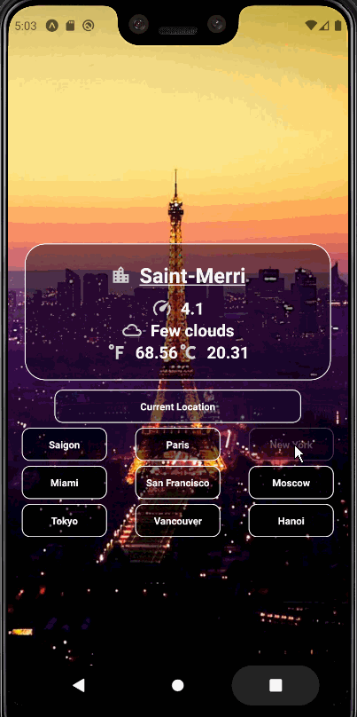

# Weather App

Try it out: https://exp.host/@tranghoang200/weather-app

## Accomplishments 🥇🏆💯

[x] User is prompted to give permission for our app to use their location if they haven't already given us permission. \
[x] User can see a locations fahrenheit & celsius temperature, description, & windspeed. \
[x] User can see an appropriate icon depending on the weather conditions. \
[x] User can see a background appropriate for the type of weather in their current location. \
[x] User can see an icon appropriate for the type of their weather in a location. \
[x] User can see buttons which allow them to see weather of different cities. \
[x] User can see a randomly generated image of that city. \
[x] User can see their current locations weather again with a "Current Location" button.

## Rockets 🚀
[ ] User will see app theme colors based on temperature of the location(blue for cold, orange for warm, red for hot)
